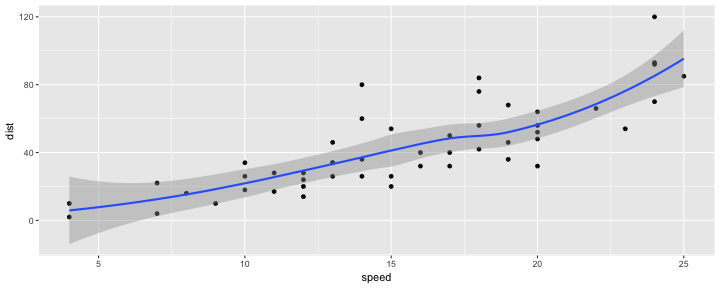

title       : Example slidify
subtitle    : Subtitle goes here
author      : Joseph Casillas
job         : PhD Candidate
framework   : io2012        # {io2012, html5slides, shower, dzslides, ...}
highlighter : highlight.js  # {highlight.js, prettify, highlight}
hitheme     : tomorrow      # 
widgets     : [mathjax, quiz, bootstrap] # {mathjax, quiz, bootstrap}
mode        : selfcontained # {standalone, draft}
knit        : slidify::knit2slides
logo        : ua.png
biglogo     : ua.png
assets      : {assets: ../../assets}
---
```

- You can make your deck look like this
- Specifically, you should add `widgets     : [mathjax, quiz, bootstrap]`

--- .class #id

## Widgets

- The widgets will allow you to...
	- make quizzes
	- use math formulas and 
	- utilize the bootstrap framework
- The logos are located in the `assets > img` folder
	- This is where you will add any other images you want to put in your presentation

--- .class #id

## RMarkdown syntax

- Markdown syntax is very easy
- You can find the basics [here](http://rmarkdown.rstudio.com)
- The main thing you need to know is that you make new slides using `---` and `##`

### `##`

- The double pound sign (hashtags) create the title of the slide
- The title of this slide was made with `## Rmarkdown syntax`

### `---`

- To end a slide use three dashes
- Importantly after you end a slide, you designate the class of the next one 
- The default (what you see here) is `.class #id`
- So I ended this slide using `--- .class #id`

--- .class #id

## 


```
## RMarkdown syntax

- Markdown syntax is very easy
- You can find the basics [here](http://rmarkdown.rstudio.com)
- The main thing you need to know is that you make new slides using `---` and `##`

### `##`

- The double pound sign (hashtags) create the title of the slide
- The title of this slide was made with `## Rmarkdown syntax`

### `---`

- To end a slide use three dashes
- Importantly after you end a slide, you designate the style of the next one 
- The default (what you see here) is `.class #id`
- So I ended this slide using `--- .class #id`

 --- .class #id
```

- This is the previous slide in markdown

--- .class #id


## Creating the deck

- Once you have made the slides in markdown you are ready to generate the html file that will be your presentation
- You do this using the `slidify()` command like this...


```r
slidify('index.Rmd')
```

- This will generate a `index.html` file. 
- Double click it and open your presentation in web browser

--- .segue bg:grey

# Incorporating r code

--- 


## R code

- You can insert code by surrounding it with \`\`\`{r}, followed by \`\`\` (three more ticks)...

\`\`\`{r}  
code here  
\`\`\`  

- Here is an example of some simple math


```r
2 + 2
```

```
## [1] 4
```

- To do this I typed

\`\`\`{r}  
2 + 2  
\`\`\`  

---

## R code (cont)

- Here is another example


```r
plot(cars)
abline(lm(dist ~ speed, data = cars), col = "red")
```


---

## R code (cont)

- Here is a more complex example


```r
library(ggplot2)
g <- ggplot(cars, aes(speed, dist))
g + geom_point() +
	geom_smooth()
```



--- .segue bg:grey

# Quizzes

--- &radio

## Radio

Eleanor scores 680 on the Mathematics part of the SAT. The distribution of SAT scores in a reference population is Normal, with mean 500 and standard deviation 100. Gerald takes the American College Testing (ACT) Mathematics test and scores 27. ACT scores are Normally distributed with mean 18 and standard deviation 6. Assuming that both tests measure the same kind of ability, who did better?

1. _Eleanor_
2. Gerald

*** .explanation

The best way to compare their performance is to calculate their standardized scores.

$$z_E = \frac{680 - 500}{100} = 1.8$$
$$z_G = \frac{27 - 18}{6} = 1.5$$

Since, Eleanor has a higher standardized score, we can conclude that Eleanor did better!

--- &radio2

## Radio (Two Column)

Which of these two scatterplots have a higher correlation?

1. A
2. B

*** =image


*** .explanation

Both have the same correlation.

---  &checkbox

## Checkbox

Linda is 31 years old, single, outspoken, and very bright. She majored in philosophy. As a student, she was deeply concerned with issues of discrimination and social justice, and also participated in anti-nuclear demonstrations.

Which is more probable?

1. _Linda is a bank teller._
2. Linda is a bank teller and is active in the feminist movement.

*** .hint

Think about the probabilities of each event, and that of both of them together.

*** .explanation

If you chose (2), stop back and think. Suppose we denote the event of Linda being a teller by A and the event she is active in the feminist movement by B, then probabilities in question can be written as.

- P(A)
- $P(A \cap B)$

This is called the [conjugacy fallacy](http://en.wikipedia.org/wiki/Conjunction_fallacy) that occurs when it is assumed that specific conditions are more probable than a single general one.

---  &multitext

## Multi Text

The length of human pregnancies from conception to birth varies according to a distribution that is approximately Normal with mean 266 days and standard deviation 16 days.

1. What percent of pregnancies last fewer than 240 days?
2. What percent of pregnancies last between 240 and 270 days?
3. How long do the longest 25% pregnancies last?

*** .explanation

1. <span class='answer'>5.2081279</span>
2. <span class='answer'>54.6625046</span>
3. <span class='answer'>276.791836</span>

*** .hint

This is a hint

---  &submitcompare1

## Submit and Compare

What is the sample space for this experiment?

*** .explanation

The sample space for this experiment is

{HH, HT, TH, HH}

---  &submitcompare2 rows:5

## Submit and Compare (2 Column)

The solid curve represents the distribution of heights of all males in the US. The dotted curve represents the distribution of heights reported by males on OkCupid, an online dating website.


*** =question

What is happening here?

*** .explanation

It is easier to interpret things if we overlay a fitted normal distribution for the heights reported by males on OkCupid. Looking at the graph carefully, we can observe two things.


1. Males on OkCupid probably tend to inflate their heights!
2. You can also see a more subtle vanity at work: starting at roughly 5' 8", the top of the dotted curve tilts even further rightward. This means that guys as they get closer to six feet round up a bit more than usual, stretching for that coveted psychological benchmark.

--- .segue bg:grey

# Interactivity

---

## Interactive Console

<div align="center">

<!-- MotionChart generated in R 3.1.3 by googleVis 0.5.8 package -->
<!-- Thu May 21 12:35:43 2015 -->


<!-- jsHeader -->
<script type="text/javascript">
 
// jsData 
function gvisDataMotionChartID10e3618c31666 () {
var data = new google.visualization.DataTable();
var datajson =
[
 [
 "Apples",
2008,
"West",
98,
78,
20,
"2008-12-31" 
],
[
 "Apples",
2009,
"West",
111,
79,
32,
"2009-12-31" 
],
[
 "Apples",
2010,
"West",
89,
76,
13,
"2010-12-31" 
],
[
 "Oranges",
2008,
"East",
96,
81,
15,
"2008-12-31" 
],
[
 "Bananas",
2008,
"East",
85,
76,
9,
"2008-12-31" 
],
[
 "Oranges",
2009,
"East",
93,
80,
13,
"2009-12-31" 
],
[
 "Bananas",
2009,
"East",
94,
78,
16,
"2009-12-31" 
],
[
 "Oranges",
2010,
"East",
98,
91,
7,
"2010-12-31" 
],
[
 "Bananas",
2010,
"East",
81,
71,
10,
"2010-12-31" 
] 
];
data.addColumn('string','Fruit');
data.addColumn('number','Year');
data.addColumn('string','Location');
data.addColumn('number','Sales');
data.addColumn('number','Expenses');
data.addColumn('number','Profit');
data.addColumn('string','Date');
data.addRows(datajson);
return(data);
}
 
// jsDrawChart
function drawChartMotionChartID10e3618c31666() {
var data = gvisDataMotionChartID10e3618c31666();
var options = {};
options["width"] =    600;
options["height"] =    500;
options["state"] = "";

    var chart = new google.visualization.MotionChart(
    document.getElementById('MotionChartID10e3618c31666')
    );
    chart.draw(data,options);
    

}
  
 
// jsDisplayChart
(function() {
var pkgs = window.__gvisPackages = window.__gvisPackages || [];
var callbacks = window.__gvisCallbacks = window.__gvisCallbacks || [];
var chartid = "motionchart";
  
// Manually see if chartid is in pkgs (not all browsers support Array.indexOf)
var i, newPackage = true;
for (i = 0; newPackage && i < pkgs.length; i++) {
if (pkgs[i] === chartid)
newPackage = false;
}
if (newPackage)
  pkgs.push(chartid);
  
// Add the drawChart function to the global list of callbacks
callbacks.push(drawChartMotionChartID10e3618c31666);
})();
function displayChartMotionChartID10e3618c31666() {
  var pkgs = window.__gvisPackages = window.__gvisPackages || [];
  var callbacks = window.__gvisCallbacks = window.__gvisCallbacks || [];
  window.clearTimeout(window.__gvisLoad);
  // The timeout is set to 100 because otherwise the container div we are
  // targeting might not be part of the document yet
  window.__gvisLoad = setTimeout(function() {
  var pkgCount = pkgs.length;
  google.load("visualization", "1", { packages:pkgs, callback: function() {
  if (pkgCount != pkgs.length) {
  // Race condition where another setTimeout call snuck in after us; if
  // that call added a package, we must not shift its callback
  return;
}
while (callbacks.length > 0)
callbacks.shift()();
} });
}, 100);
}
 
// jsFooter
</script>
 
<!-- jsChart -->  
<script type="text/javascript" src="https://www.google.com/jsapi?callback=displayChartMotionChartID10e3618c31666"></script>
 
<!-- divChart -->
  
<div id="MotionChartID10e3618c31666" 
  style="width: 600; height: 500;">
</div>
</div>

--- .segue bg:grey

## HTML widgets

---

## HTML widget library

HTML widgets are interactive graphics made for the web. These are the main libraries available:

- [leaflet](https://rstudio.github.io/leaflet/): interactive maps
- [dygraphs](https://rstudio.github.io/dygraphs/): charting time series data
- [metricsgraphics](http://www.htmlwidgets.org/showcase_metricsgraphics.html): scatterplots, linegraphs and histograms
- [networkD3](http://christophergandrud.github.io/networkD3/): network graphs
- [DT](https://rstudio.github.io/DT/): print dataframes as html
- [threejs](http://www.htmlwidgets.org/showcase_threejs.html): 3d scatterplots and [globes](https://www.chromeexperiments.com/globe)
- [DiagrammeR](http://rich-iannone.github.io/DiagrammeR/): pretty diagrams


---

## leaflet


<iframe src="./assets/widgets/leaflet1.html" width=100% height=100% allowtransparency="true"> </iframe>

---

## dygraphs

<iframe src="./assets/widgets/dygraphs1.html" width=100% height=100% allowtransparency="true"> </iframe>

---

## dygraphs (cont)

<iframe src="./assets/widgets/dygraphs2.html" width=100% height=100% allowtransparency="true"> </iframe>

---

## dygraphs (cont)

<iframe src="./assets/widgets/dygraphs3.html" width=100% height=100% allowtransparency="true"> </iframe>

---

## dygraphs (cont)

<iframe src="./assets/widgets/dygraphs4.html" width=100% height=100% allowtransparency="true"> </iframe>

---

## metricsgraphics

<iframe src="./assets/widgets/metricsgraphics1.html" width=100% height=100% allowtransparency="true"> </iframe>

---

## metricsgraphics (cont)

<iframe src="./assets/widgets/metricsgraphics2.html" width=100% height=100% allowtransparency="true"> </iframe>

---

## metricsgraphics (cont)

<iframe src="./assets/widgets/metricsgraphics3.html" width=100% height=100% allowtransparency="true"> </iframe>

---

## metricsgraphics (cont)

<iframe src="./assets/widgets/metricsgraphics4.html" width=100% height=100% allowtransparency="true"> </iframe>

---

## metricsgraphics (cont)

<iframe src="./assets/widgets/metricsgraphics5.html" width=100% height=100% allowtransparency="true"> </iframe>

---

## metricsgraphics (cont)

<iframe src="./assets/widgets/metricsgraphics6.html" width=100% height=100% allowtransparency="true"> </iframe>

---

## networkD3

<iframe src="./assets/widgets/networkD31.html" width=100% height=100% allowtransparency="true"> </iframe>

---

## networkD3 (cont)

<iframe src="./assets/widgets/networkD32.html" width=100% height=100% allowtransparency="true"> </iframe>

---

## DT

<iframe src="./assets/widgets/dt1.html" width=100% height=100% allowtransparency="true"> </iframe>

---

## threejs

<iframe src="./assets/widgets/threejs1.html" width=100% height=100% allowtransparency="true"> </iframe>

---

## threejs (cont)

<iframe src="./assets/widgets/threejs2.html" width=100% height=100% allowtransparency="true"> </iframe>

---

## DiagrammeR

<iframe src="./assets/widgets/diagrammer1.html" width=100% height=100% allowtransparency="true"> </iframe>

---

## DiagrammeR (cont)

<iframe src="./assets/widgets/diagrammer2.html" width=100% height=100% allowtransparency="true"> </iframe>
